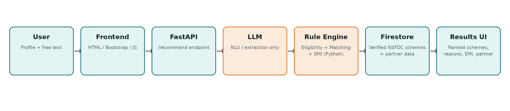

# SIH 2026 — PS26092 (PS92) — AI-Driven NSFDC Scheme & Channel Partner Navigator
### Team GaneshNiti

An AI-assisted web platform that helps Scheduled Caste entrepreneurs and students find the right NSFDC credit scheme (Micro Credit Finance, Term Loan, or Educational Loan), understand exactly why they're eligible, calculate their real repayment figure, and find a Channel Partner to apply through — without needing to understand government scheme jargon first.

**Core principle: AI understands the entrepreneur; verified rules evaluate eligibility.**
The AI never decides who is eligible. Deterministic, verifiable Python rules do that, using NSFDC's own published numeric criteria. The AI's only job is turning a person's plain-language description of their situation into structured data.

---

## How It Works



1. A user fills in a short profile (category, state, income, business type, amount required) and describes their need in their own words.
2. The backend sends that free-text description to an LLM (via OpenRouter), which converts it into structured data — nothing more. If extraction fails or returns something invalid, the system safely falls back to the structured form fields the user already typed.
3. Verified NSFDC scheme data (researched from official government sources) is checked against the user's structured profile using plain, deterministic Python rules — producing a **numeric trace** for every rule (the user's value vs. the scheme's limit, pass/fail), not just a yes/no.
4. Eligible schemes are ranked by **financing fit** (loan-size suitability, purpose match — not generic profile similarity), a **quarterly repayment figure** is calculated for the top match (NSFDC repays in quarterly installments, not monthly), and a matching **Channel Partner** is suggested (simulated data — clearly labelled as such).
5. The frontend displays everything back to the user — including exactly *why* each scheme matched, the repayment figure, and the suggested partner.

---

## What's Real vs. Simulated

- **Scheme data (NSFDC schemes) is real** — verified against official sources (nsfdc.nic.in, NSFDC policy documents, PIB press releases), with a source URL and last-verified date on every record.
- **Channel Partner data is simulated** — real-time partner availability and fund-utilization/NPA data are not publicly available. This is a deliberate, documented scope decision, not an oversight. Always say this out loud in any demo.
- **The LLM never decides eligibility** — only the deterministic rule engine does.

---

## Tech Stack

| Layer | Technology |
|---|---|
| Frontend | HTML + Bootstrap + JavaScript |
| Backend | Python + FastAPI |
| Database | Firebase Firestore (evaluated against Supabase/PostgreSQL — Firestore chosen for shallow relational needs at this scale and lower operational risk; see project notes) |
| AI | LLM API via OpenRouter (natural-language understanding only — no eligibility decisions, no custom-trained model) |
| Eligibility, Matching & Repayment | Plain Python, deterministic and unit-tested — no ML |

Deliberately simple. No microservices, no vector databases, no custom-trained ML models.

---

## Project Structure

```
GaneshNiti/
  backend/
    main.py                    <- FastAPI app entrypoint
    requirements.txt
    serviceAccountKey.json     <- Firebase credentials (YOU create this, gitignored, never committed)
    .env                        <- OPENROUTER_API_KEY etc. (YOU create this, gitignored, never committed)
    services/
      eligibility_engine.py     <- deterministic eligibility checks + numeric trace
      matching_engine.py        <- financing-fit ranking
      emi_calculator.py         <- quarterly repayment calculator
      llm_extraction.py         <- LLM call (OpenRouter) + validation + fallback
      firestore_client.py       <- Firestore reads, with local-JSON fallback
      partner_locator.py        <- Channel Partner matching (simulated data)
    routers/
      schemes.py                 <- GET /schemes, GET /channel-partners
      recommend.py               <- POST /recommend (the core endpoint)
    tests/
      test_eligibility.py
      test_matching_engine.py
      test_emi_calculator.py
      test_partner_locator.py
    data/
      schemes_preview.json           <- local fallback copy of verified scheme data
      channel_partners_preview.json  <- local fallback copy of simulated partner data
  frontend/
    index.html      <- landing page
    profile.html    <- profile + free-text input form
    results.html    <- renders ranked scheme cards, trace, repayment, partner
    css/
      style.css
    js/
      app.js         <- form submission (fetch to /recommend) + card rendering
  data/
    PS92_Scheme_Research.xlsx   <- master verified scheme spreadsheet
    upload_schemes.py            <- reads the spreadsheet, uploads to Firestore
  README.md
  architecture_diagram.png
```

---

## Setting Up Firestore (do this once, locally, per machine)

Firestore credentials are **never committed to GitHub** — each teammate who needs to run the real backend (not just the local-JSON fallback) sets this up on their own machine.

### 1. Get the service account key
- If the team already created a Firebase project: ask whoever set it up to share `serviceAccountKey.json` through a private channel (not GitHub, not Slack public channel — DM or a shared drive).
- If it doesn't exist yet: go to [console.firebase.google.com](https://console.firebase.google.com) → create a project → Build → Firestore Database → Create database (test mode) → Project Settings → Service Accounts → Generate new private key.

### 2. Place the key correctly
Put the downloaded file at exactly:
```
backend/serviceAccountKey.json
```
(Same folder as `main.py` — not inside `services/`, not inside `data/`.)

### 3. Create your `.env` file
Create `backend/.env` with:
```
OPENROUTER_API_KEY=your-real-key-here
```

### 4. Confirm both are gitignored
Run `git status` — neither `serviceAccountKey.json` nor `.env` should appear in the list of changes. If they do, stop and check `.gitignore` before doing anything else.

### 5. Upload the verified scheme data
```
cd data
pip install firebase-admin openpyxl
python upload_schemes.py --dry-run     # safe preview first, no database needed
python upload_schemes.py               # real upload once the preview looks right
```

### 6. Confirm it's live
Start the backend and check:
```
cd ../backend
uvicorn main:app --reload
```
Visit `http://127.0.0.1:8000/schemes` — the response should show `"source": "firestore"`. If it shows `"source": "local_fallback"` instead, the credentials file isn't being found — double-check step 2.

---

## Running the Full App Locally

```
cd backend
pip install -r requirements.txt
uvicorn main:app --reload
```

Then open `frontend/index.html` directly in your browser (no server needed for the frontend — it's plain HTML/JS making `fetch()` calls to the backend).

Test the core endpoint directly:
```
curl -X POST http://127.0.0.1:8000/recommend \
  -H "Content-Type: application/json" \
  -d '{"category": "SC", "state": "Maharashtra", "annualIncome": 280000, "businessType": "tailoring", "amountRequired": 120000, "isNewBusiness": false, "requirement": "I need money for sewing machines"}'
```

---

## Running the Tests

```
cd backend
pytest tests/ -v
```

---

## Team

| Role | Focus |
|---|---|
| Backend Lead | Eligibility engine, matching engine, EMI/repayment calculator |
| Backend/Data | Firestore, LLM extraction, Channel Partner locator |
| Frontend Lead | Profile form, fetch logic |
| Frontend/UI | Results page, scheme cards, styling |
| Data/QA | Scheme data verification, testing, demo case validation |
| Documentation/Presentation | README, architecture diagram, PPT, demo script |

---

## Status

- [x] Scheme research spreadsheet — verified against official NSFDC sources
- [x] Firestore upload script — built and tested
- [x] Firestore live upload
- [x] Eligibility engine (with numeric trace, unit-tested)
- [x] LLM extraction (OpenRouter, with schema validation + fallback)
- [x] Matching/ranking + quarterly repayment calculator
- [x] Channel Partner Locator (simulated data)
- [x] Frontend integration (real `/recommend` calls, not dummy data)
- [ ] Final UI polish
- [ ] Deployment (optional)
- [ ] Demo rehearsal
